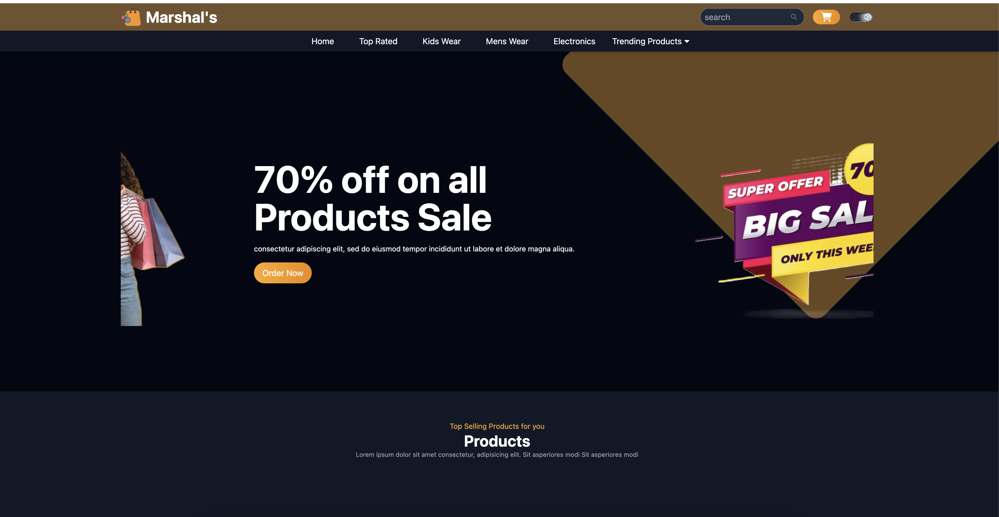
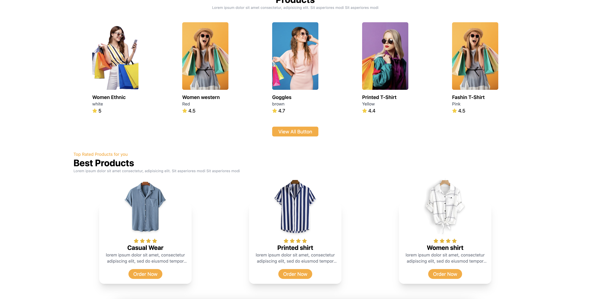

# Ecommerce Web App


## Overview

This is an ecommerce web application built with React and Vite, featuring a modern and responsive design. The project leverages various libraries and tools for enhanced functionality and a seamless user experience.

## Features

- **Animation on Scroll (AOS):** Incorporates AOS library for smooth animations.
- **React Icons:** Utilizes a wide range of icons using the React Icons library.
- **Slick Carousel:** Implements a responsive image carousel with React Slick and Slick Carousel.
- **Tailwind CSS:** Styling is done using Tailwind CSS for a clean and consistent UI.

## Screenshots


*Caption: The homepage showcasing featured products.*


*Caption: Detailed view of a product with additional information.*


*Caption: Detailed view of a product with additional information.*

## Installation

1. Clone the repository:

   ```bash
   git clone https://github.com/your-username/11_ecommerce_web.git